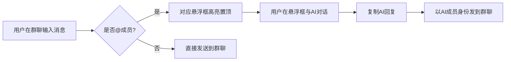

## 1. 产品概述
AI群聊模拟器是一个模拟6人微信群聊的纯前端网页应用。用户作为群主，可在左侧主聊天窗口发送文字/图片并 @ 其他5位AI成员；右侧5个可拖拽悬浮框分别嵌入 DeepSeek、豆包、ChatGPT、Gemini、Grok 等AI网页（可自定义替换为千问等），用户在悬浮框内直接与AI对话，再将回复复制粘贴到群聊中，实现"群聊里@不同AI成员并获得回复"的体验。
- 目标用户：希望在一个界面同时与多家AI对话、对比回复的个人用户
- 核心价值：把分散的AI网页聚合到一个"群聊"场景，提升多AI协作效率

## 2. 核心功能

### 2.1 用户角色
| 角色 | 说明 |
|------|------|
| 群主（用户） | 发送消息、@成员、管理AI网址、复制粘贴AI回复 |
| AI成员 ×5 | 对应右侧悬浮框，可被@，头像与悬浮框联动高亮 |

### 2.2 功能模块
1. **左侧主聊天窗口**：模拟微信群，6人群聊，发文字/图片，@成员，消息气泡分左右
2. **右侧5个AI悬浮框**：嵌入AI网页（iframe），可拖拽、缩放、最小化、置顶
3. **网址管理面板**：编辑各悬浮框的AI网址（默认5家，可换千问等）
4. **@联动**：@某成员时，对应悬浮框高亮闪烁并自动置顶
5. **快捷复制**：悬浮框顶部提供"复制到群聊"按钮，一键把AI回复以该成员身份发到群聊

### 2.3 页面详情
| 页面名称 | 模块名称 | 功能描述 |
|-----------|-------------|-----|
| 主界面 | 左侧聊天窗口 | 消息流、输入框、@选择器、图片上传、发送 |
| 主界面 | 右侧悬浮框群 | 5个嵌入式AI网页窗口，拖拽/缩放/最小化 |
| 主界面 | 顶部工具栏 | 群名"AI智囊团"、成员管理、网址配置入口 |
| 主界面 | 网址配置弹窗 | 5个成员的网址输入、重置默认、保存 |

## 3. 核心流程
1. 用户在左侧聊天窗口输入消息，可选择 @ 某位AI成员
2. 发送后，被 @ 成员对应的右侧悬浮框高亮闪烁并置顶
3. 用户在该悬浮框内（iframe）直接与对应AI网页对话
4. 用户复制AI回复，点击悬浮框"复制到群聊"按钮（或手动粘贴）
5. 以该AI成员身份在群聊中显示回复消息

## 4. 用户界面设计

### 4.1 设计风格
- 主色调：微信绿（#07C160）+ 深灰底（#1F2937），现代深色主题
- 群聊气泡：群主右侧绿色，AI成员左侧白色
- 悬浮框：半透明深色毛玻璃（backdrop-blur），可拖拽
- 字体：中文"HarmonyOS Sans"/"思源黑体"，英文"Inter"
- 头像：圆形，5个AI各有品牌色（DeepSeek蓝、豆包紫、ChatGPT绿、Gemini多彩、Grok黑）

### 4.2 页面设计概览
| 页面名称 | 模块名称 | UI元素 |
|-----------|-------------|-----|
| 主界面 | 左侧聊天 | 消息流、输入栏、@弹窗、图片预览、发送按钮 |
| 主界面 | 右侧悬浮框 | 5个毛玻璃窗口、网址栏、复制按钮、最小化 |
| 主界面 | 顶部工具栏 | 群名、成员头像列表、设置齿轮 |
| 主界面 | 配置弹窗 | 5行网址输入、品牌logo、重置/保存 |

### 4.3 响应式
- 桌面优先（1920×1080最佳）
- 中屏（≥1280px）保持6框布局
- 小屏（<1024px）右侧悬浮框折叠为底部标签栏

### 4.4 技术约束说明（iframe嵌入限制）
部分AI官网（如 ChatGPT、Gemini）设置 `X-Frame-Options: DENY` 或 `CSP: frame-ancestors`，禁止被iframe嵌入。处理策略：
- 默认尝试iframe加载各AI官网
- 检测加载失败/超时（3秒）时，显示兜底UI：品牌logo + "在新标签页打开"按钮
- 用户可在配置面板替换为允许嵌入的镜像站/移动版网址（如 m.chatgpt.com）
- 提供"复制网址"快捷方式，方便用户在浏览器中打开
