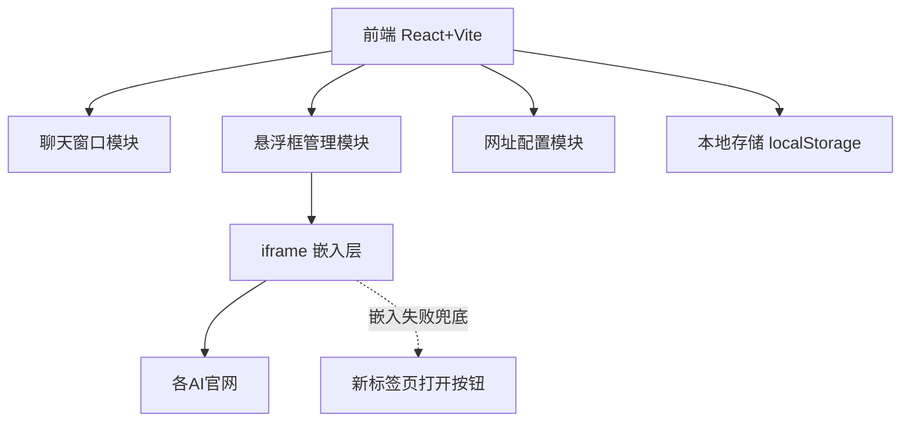

## 1. 架构设计



纯前端单页应用，无后端。所有状态与数据存于浏览器 localStorage。

## 2. 技术栈
- 前端：React@18 + Vite@5 + TailwindCSS@3
- 拖拽/缩放：react-rnd（可拖拽+可调整大小）
- 图标：lucide-react
- 状态管理：React Context + useReducer
- 数据存储：localStorage（聊天记录、网址配置、悬浮框位置）
- 后端：无

## 3. 路由定义
| 路由 | 用途 |
|-------|-----|
| / | 主界面（聊天 + 5个悬浮框） |

单页应用，无多路由。

## 4. 数据模型

### 4.1 成员配置
```typescript
interface Member {
  id: string;            // 'deepseek' | 'doubao' | 'chatgpt' | 'gemini' | 'grok'
  name: string;          // 显示名
  avatar: string;        // 品牌emoji或首字母
  url: string;           // AI网页地址（可编辑）
  color: string;         // 品牌主色
  embeddable: boolean;   // 是否可嵌入（首次加载后更新）
}
```

### 4.2 聊天消息
```typescript
interface Message {
  id: string;
  senderId: string;      // 'me' 或成员id
  type: 'text' | 'image';
  content: string;       // 文本或图片DataURL
  mentionedIds?: string[]; // 被@的成员id
  timestamp: number;
}
```

### 4.3 悬浮框状态
```typescript
interface FloatWindowState {
  memberId: string;
  x: number; y: number;
  width: number; height: number;
  minimized: boolean;
  zIndex: number;
  highlighted: boolean;  // 被@时高亮
}
```

## 5. iframe 嵌入策略
- 使用 `<iframe>` 加载用户配置的AI网址
- 监听 `onError` + 加载超时（3秒）判断是否被禁止嵌入
- 被禁止时显示兜底UI：品牌logo + "在新标签页打开"按钮 + 网址编辑入口
- 提供网址输入框，用户可随时更换（如换移动版）
- 由于浏览器同源策略，无法读取iframe内部内容，故采用"用户手动复制 + 一键粘贴到群聊"的交互

## 6. 默认AI网址
| 成员 | 默认网址 | 品牌色 | 备注 |
|------|---------|-------|------|
| DeepSeek | https://chat.deepseek.com | #4D6BFE | 通常可嵌入 |
| 豆包 | https://www.doubao.com/chat | #7C3AED | |
| ChatGPT | https://chat.openai.com | #10A37F | 禁止嵌入，提供兜底 |
| Gemini | https://gemini.google.com | #4285F4 | 禁止嵌入，提供兜底 |
| Grok | https://grok.x.ai | #1DA1F2 | |

## 7. 关键交互实现
- **@联动**：输入框检测 `@` 触发成员选择弹窗；选中后在该成员悬浮框加 `highlighted` 状态，触发闪烁动画 + 提升 zIndex
- **图片发送**：FileReader 读取为 DataURL，存入消息（localStorage 容量限制，大图提示）
- **复制到群聊**：悬浮框顶部按钮触发 `navigator.clipboard.readText()` 读取剪贴板，以该成员身份创建消息
- **拖拽缩放**：react-rnd 控制5个悬浮框的位置与尺寸，状态持久化到 localStorage
